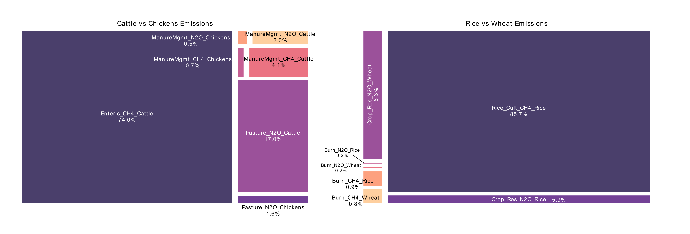

              

## Food Carbon Impact: What's on Your Plate?

This report breaks down a data project that analyzes how much our food choices impact climate change, using data from the Food and Agriculture Organization (FAO).

## What We Did

We looked at food emissions from different angles:
- How food shipping creates emissions
- Which foods produce the most greenhouse gases
- How countries compare in food-related emissions
- What might happen with food emissions in the future

## Key Findings

### Food Miles Matter

Looking at how food shipping affects climate:
- Asia and Europe import the most food
- North America and South America export the most
- The North America → Asia route creates the most shipping emissions
- Europe's total imports generate the highest shipping emissions globally

    <b>2022 Food Emissions Between Continents in relation with trade</b>

    
     

Crops travel more than animal products, with **soya beans** being the most transported food item, causing **over 20,000 kilotonnes of CO2-equivalent emissions yearly**. Most soya goes to Europe.

    <b>Soya Beans Top Contaminating Trades (2021)</b>

    
     

### Production Emissions: Animals vs Plants

While crops cause more shipping emissions, livestock creates WAY more production emissions:
- Livestock emissions are growing by 2771.76 kilotonnes yearly
- Crop emissions grow by only 408.02 kilotonnes yearly
- Livestock emissions are about 7 times higher than crops
- Cattle products and rice are the highest emitters in their categories

    <b>Crops vs Livestock Production Emissions (2021)</b>

    

Why cattle and rice emit so much:
- Cattle: 90% comes from **enteric fermentation** (digestive methane) and **pasture** (nitrous oxide)
- Rice: 85% from **rice cultivation** (methane from flooded fields)

    

### Food Groups: Not Just Animal vs Plant

Foods cluster into four groups with surprising mixes of plants and animals:
- **Group 1**: Soybeans, wheat, maize - high shipping emissions
- **Group 4**: Cattle and rice - highest production emissions
- **Groups 2-3**: Other crops and animals with lower impacts

    <b>Clustermap of Food Items with Environmental and Production Data</b>

    

### Future Trends

Food emissions have jumped 10% in two decades, hitting **16.4 gigatons of CO2** in 2021, and growing about 1.5% yearly. Asia leads emissions, and forecasts show continued growth through 2030, especially in Asia, Africa, and Europe.

    <b>Forecasted Agrifood Emissions by Region</b>

    

### Country Hotspots

Countries fall into six emission groups:
- **The Giant**: China alone - massive emissions across all categories
- **Major Emitters**: US and India
- **Deforestation Hotspots**: Brazil, Congo, and Indonesia
- **Emerging Deforestation Areas**: Bolivia, Peru, Mozambique
- **Big Agricultural Producers**: Argentina, Australia, Russia
- **Smaller Producers and Importers**: Over 100 countries including Spain, Chile, Portugal

    <b>Map of Country Clusters (2021 data)</b>

    

## Data Notes

The FAO data covers:
- 245+ countries and territories
- 200+ crops and livestock products
- Production, trade, and emissions info
- Historical data back to 1961

We processed this massive dataset to calculate:
- Shipping distances between countries
- Transportation methods and their emissions
- CO2 equivalents for different greenhouse gases
- Production emissions for different foods

  
